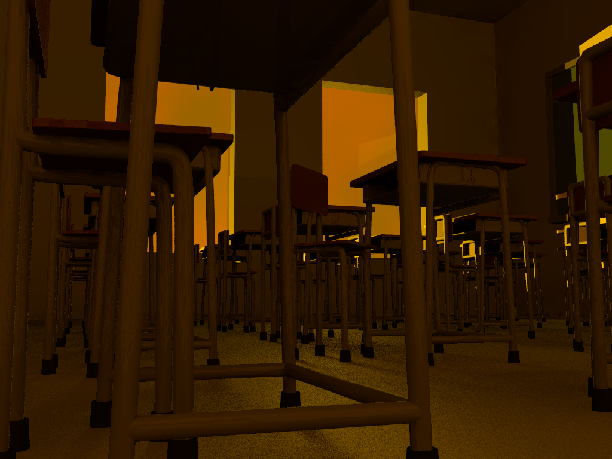

# 2021/4/29
|←|→|
|:---|---:|
go to the [previous page](./28th.md) | go to the [next page](./30th.md)

## Univ.
### courses
- nothing

### homework
- use POV-ray to make CG!!!
    - To be continue.
    - this is the intermediate image. Great work, isn't it?
    

## Competitive Programming
- no contents

## Else
- I couldn't solve any problem of competitive programming..
