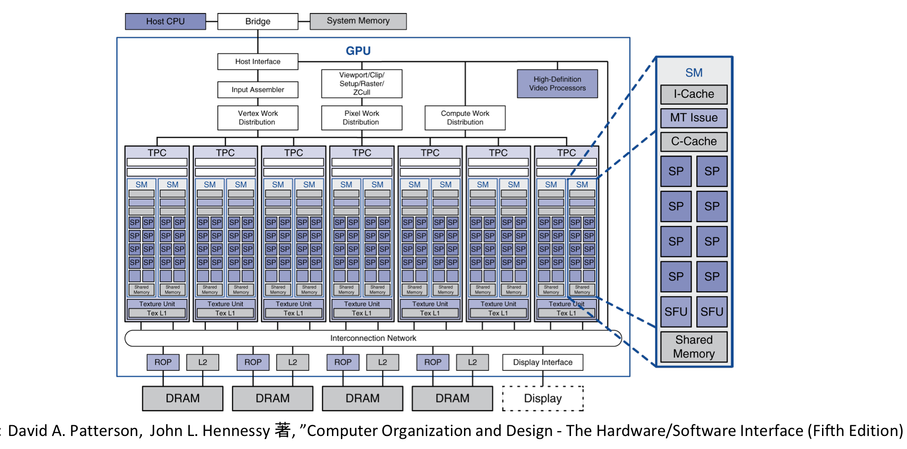
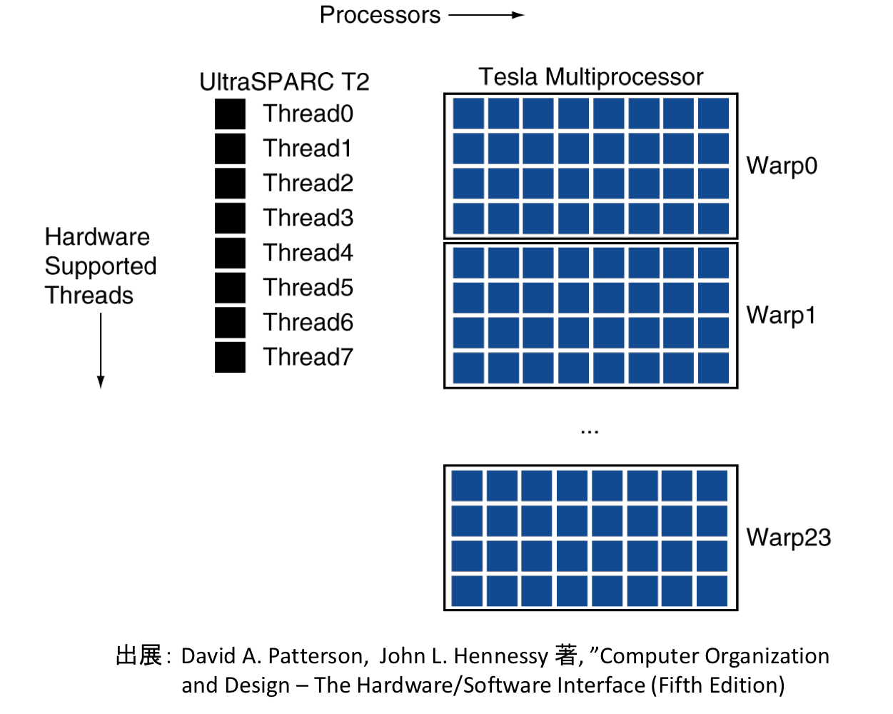

# 2021/5/18
|←|→|
|:---|---:|
go to the [previous page](./17th.md) | go to the [next page](./19th.md)

## Univ.
### courses
#### *Computer Architecture*
- **Architecture of *Accelerator & GPU!***
    - GPU, FPGA, Domain Specific Architecture
    - TPU:  
        AI accelerator  
        Matrix Multiply Unit  
        In calculous of Deep Learning, faster than GPU/CPU & higher Performance per Watt.
    - **GPU**  
        high level multi threading  
        thread switch -> hide memory access latency  
        GPGPU (general purpose GPU)  
        -> heterogeneous system architecture (use CPU & GPU)  
        **Architecture**  
          
        - SM : Streaming Multiprocessor  
        - SP : Streaming Processor (in SM)  
            
    - **CUDA**  
        computer language for NVIDIA-GPU  
        - edit as an expansion of C/C++  
        - Single Instruction Multiple Thread  
        - distinguish functions for CPU & one for GPU  
        `__host__` : executed on host CPU  
        `__global__` : executed on GPU, invoked by CPU  
        `__device__` : executed on GPU, invoked by GPU  
        - explicitly allocate memory & transport data between CPU and GPU  
        `cudaMalloc(void **devptr, size_t count)`  
        `cudaFree(void **devptr)`  
        `cudaMemcpy(void *dst, void *src, size_t count, enum cudaMemcpyKind direction)`  
        - function call  
        `function<<<dimGrid, dimBlock>>>()`  
        -> `dimGrid` (`dim3`) : variable indicating size of Grid  
        -> `dimBlock` (`dim3`) : variable indicating size of Block  

        - file extension: `.cu`  
        - compile  
            `nvcc hoge.cu -o fuga`  
        - optimize & compile  
            `nvcc -O3 hoge.cu -o fuga`  
        - execute  
            just run generated bin file  

        **e.g.**  
        original function `cpu_inc()`  
        ``` C++
        // original
        void cpu_inc(int *x, int len) {
            // run for loop
            for (int i = 0; i < len; ++i) {
                x[i] += 1;
            }
        }

        int main {
            ...
            cpu_inc(a, n);
            ...
        }
        ```
        cuda function `gpu_inc()`  
        ``` C++
        // cuda
        __global__ void gpu_inc(int *x, int len) {
            int i = blockIdx.x * blockDim.x + threadIdx.x;
            // in every thread
            if (i < len) x[i] += 1;
        }

        int main {
            ...
            grid.x = 32, block.x = 64;
            gpu_inc<<<grid, block>>>(a, n);
            ...
        }
        ```

#### Computer Algorithm
- *Graph, adjacency matrix, adjacency list, DFS, BFS*
    - directed / undirected
    - weighted
    - simple : (no loop, no multiple edges)
    - connected / disconnected
    - DFS (use recursion or stack)
    - BFS (use queue)

#### Computer Algorithm
- *Graph2, SSSP (single source shortest path)*
    - dijkstra's algorithm
    - Bellman-Ford algorithm

#### Communication Theory
- Review & Exercise

### homework
- **Reading in English**
    - summarize some part of "recollections" written by Darwin.

## Competitive Programming
- no contents

## Reading papers, articles, books
- no contents

## Else
- **make a large update on the design of daily_log**  
    **Commits**  
    - [update design](https://github.com/OtsuKotsu/daily_log/commit/3916c8d42651080a365615b2e606829080768ed8)
    - [customize css](https://github.com/OtsuKotsu/daily_log/commit/102c2b1d108481e03d26407273202dac7e8f9977)
    - [fix background](https://github.com/OtsuKotsu/daily_log/commit/b6c11039201dfe7247897cedd367dd90f1692931)
    - [fix background](https://github.com/OtsuKotsu/daily_log/commit/f27d4de60fac5bd5de2faa4ac48bf4a963999ece)

## MEMO
- no contents
