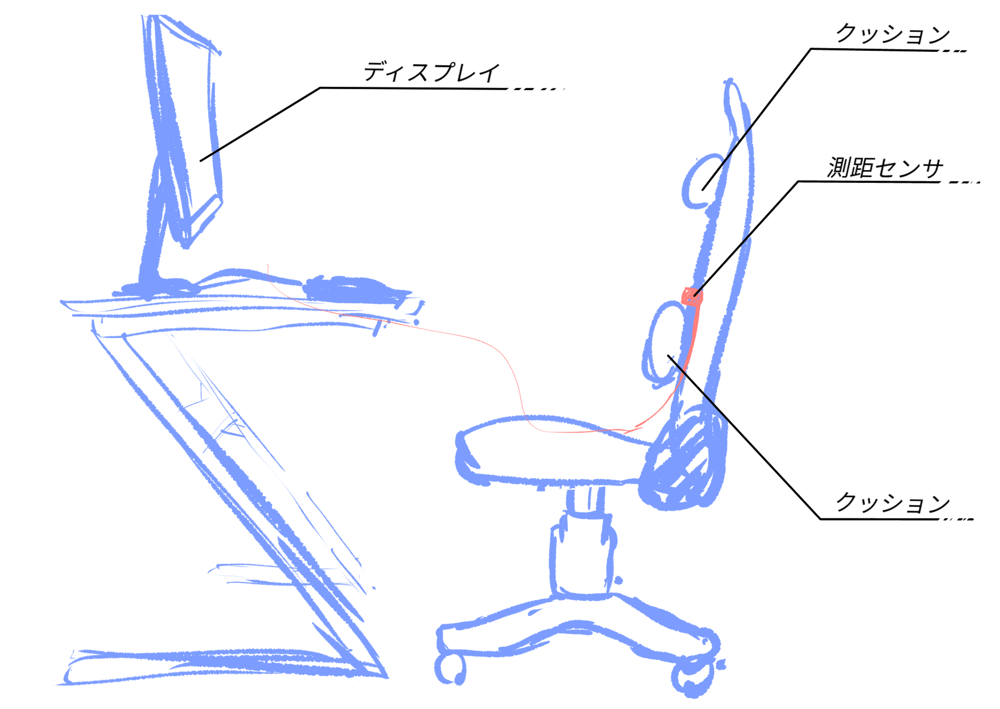
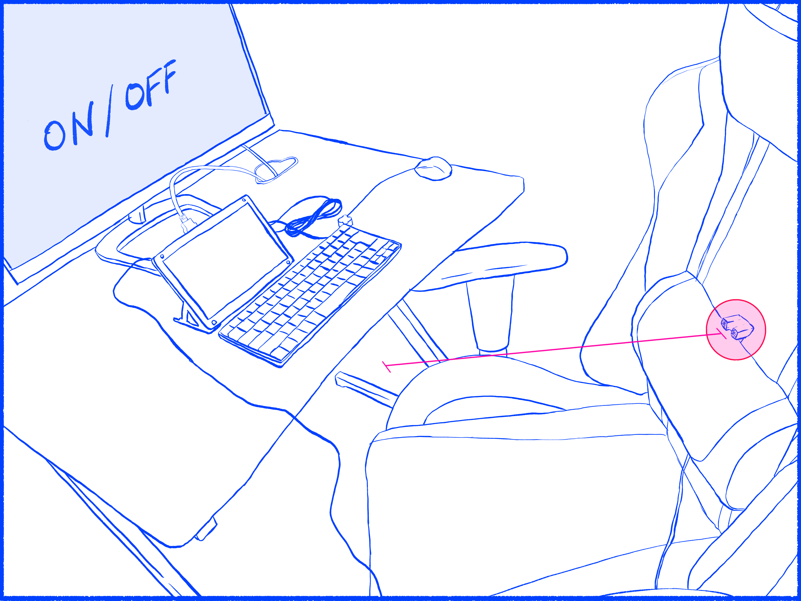

# 2021/5/22
|←|→|
|:---|---:|
go to the [previous day](21st.md) | go to the [next day](23rd.md)

## Univ.
### courses
- no contents

### homework
#### *Laboratories in CS*
- write a report
  - drawings  
      
      

#### *Network Engineering*
- write a report

## Other Activities
- cut my hair by myself

### Reading papers, articles, books
- read the abstract of [Are Convolutional Neural Networks or Transformers more like human vision?](https://arxiv.org/abs/2105.07197)
- read the abstract of [Pay Attention to MLPs (gMLP)](https://arxiv.org/abs/2105.08050)
  - [papers with code](https://paperswithcode.com/paper/pay-attention-to-mlps)

### Competitive Programming
- no contents

## MEMO
- no contents
