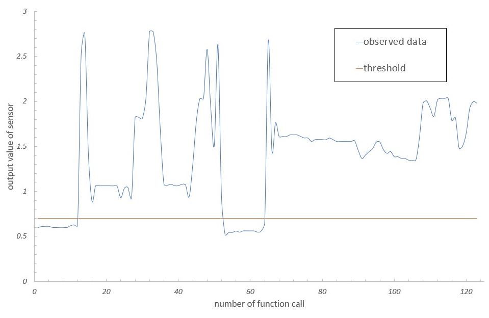

# 2021/5/23
|←|→|
|:---|---:|
go to the [previous day](./22nd.md) | go to the [next day](./24th.md)

## Univ.
### courses
- no contents

### homework
#### *Laboratories in CS*
- [x] finished writing a report
  - created graph  
      
    when the output value is lower than threshold, there is no man in the chair.  
    the sensor detects human movement successfully.  
- [x] finished writing a presentation

## Other Activities
*.oO ( what did I do today..? )*
- add 404.md into this repository & update configuration

### Reading papers, articles, books
- read [松尾ぐみの論文の書き方：英語論文](http://ymatsuo.com/old2/matsuogumi_eigo_ronbun.htm)

### Competitive Programming
- no contents

## Memo, Feelings, Thoughts
-  ***Now, I can go to bed! Hoooooray!!!***
- how should I choose a lab.?
