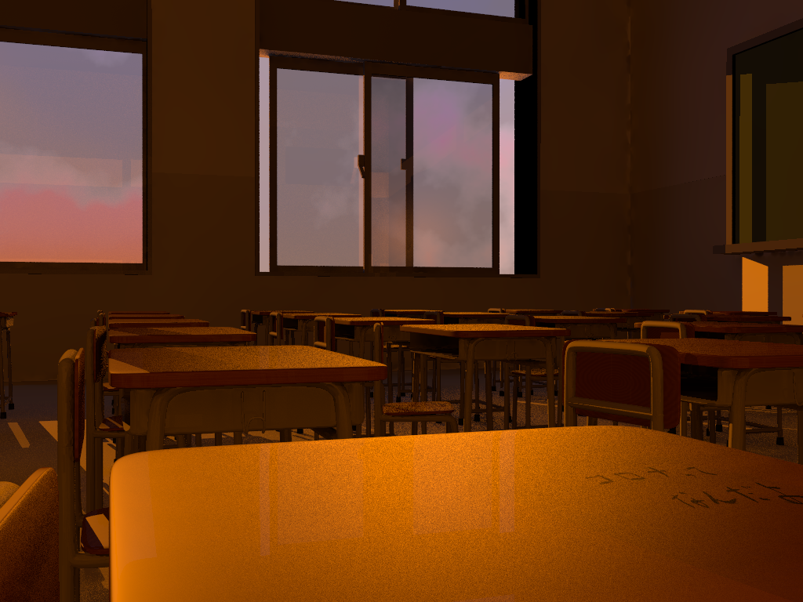

# 2021/5/5
|←|→|
|:---|---:|
go to the [previous page](./4th.md) | go to the [next page](./6th.md)

## Univ.
### courses
- no contents

### homework
- finished writing the report on my CG art written with POV-Ray 
    

## Competitive Programming
- no contents

## Reading papers, articles, books
- read **The Rust Programming Language**. 6 to 7.4
    - [Next](https://doc.rust-jp.rs/book-ja/ch07-05-separating-modules-into-different-files.html)

## Else
- .oO FINISHED!!! (the Report)
- .oO btw, I could not solve any problems of competitive programming..
- cut my hair (didn't have my hair cut)
